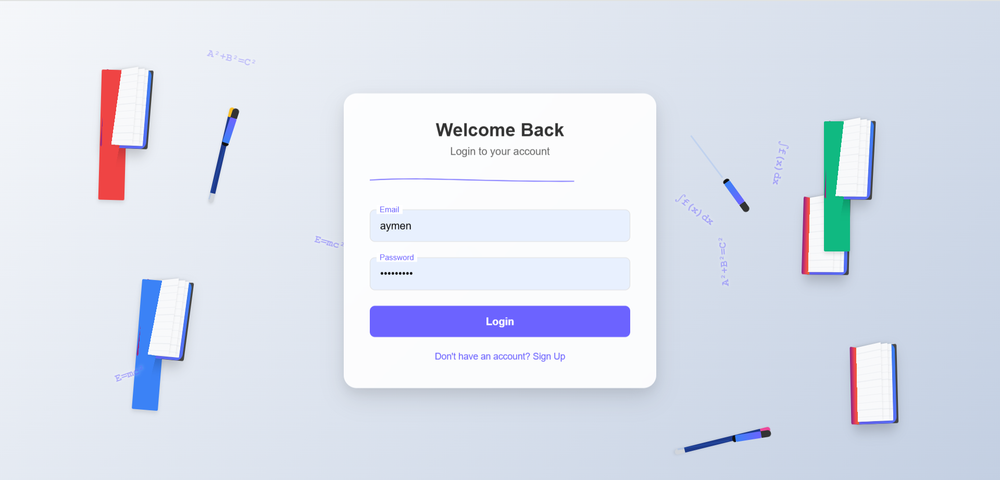
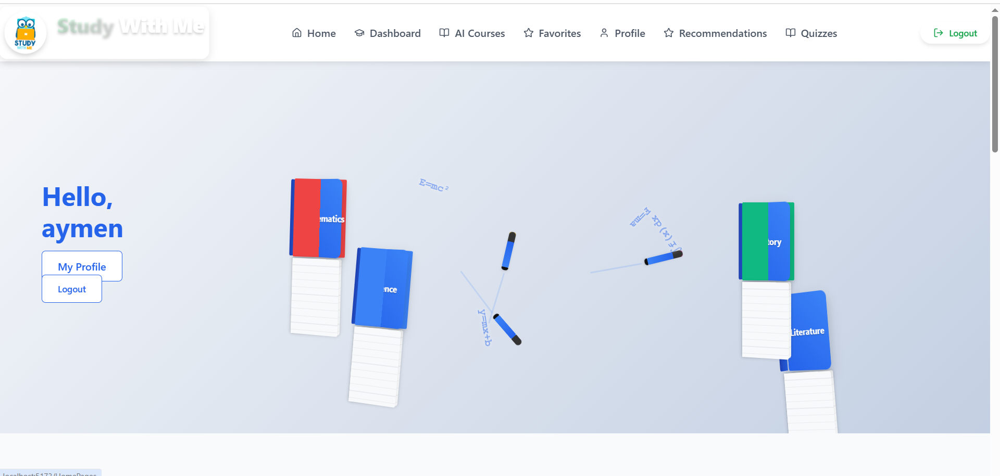

# Study with me - Modern Educational Platform


## Overview

NovaUni is a comprehensive educational platform designed to modernize the learning experience for students and educators. The platform combines course management, AI-generated content, quiz functionality, and interactive learning materials to provide a complete educational ecosystem.

## Features

### 🎓 Course Management
- Browse courses by category
- Detailed course view with descriptions and video content
- Save favorite courses for quick access
- AI-powered course generation


### 👨‍🎓 Student Management
- Student profiles with personalized course recommendations
- Track learning progress
- Specialization options for customized learning paths


### 📊 Quiz System
- Interactive quizzes for knowledge assessment
- Time-limited quizzes
- Immediate feedback and scoring
- AI-generated quiz content


### 🤖 AI Integration
- AI-powered course content generation
- Personalized learning recommendations
- Automatic content categorization


### 👩‍🏫 Administrator Tools
- Comprehensive dashboard for monitoring
- Student and course management
- Content creation and editing tools


## Tech Stack

### Frontend
- **React.js**: Modern, component-based UI library
- **React Router**: Client-side routing
- **CSS/SCSS**: Custom styling with modular approach
- **Vite**: Fast development and building

### Backend
- **FastAPI**: High-performance Python web framework
- **MongoDB**: NoSQL database for flexible data storage
- **Motor**: Asynchronous MongoDB driver
- **OpenAI/OpenRouter**: AI integration for content generation

### Testing
- **Cypress**: End-to-end testing

## Architecture

NovaUni follows a modern microservices architecture:

```
┌─────────────┐      ┌─────────────┐      ┌─────────────┐
│             │      │             │      │             │
│  React.js   │◄────►│  FastAPI    │◄────►│  MongoDB    │
│  Frontend   │      │  Backend    │      │  Database   │
│             │      │             │      │             │
└─────────────┘      └──────┬──────┘      └─────────────┘
                            │
                     ┌──────▼──────┐
                     │             │
                     │  AI APIs    │
                     │  Integration│
                     │             │
                     └─────────────┘
```

## Getting Started

### Prerequisites
- Node.js (v16+)
- Python (3.9+)
- MongoDB

### Installation

#### Backend Setup
```bash
# Clone the repository
git clone https://github.com/maizaaymen/NovaUni.git
cd NovaUni

# Set up Python virtual environment
python -m venv venv
source venv/bin/activate  # On Windows: venv\Scripts\activate

# Install dependencies
cd backend
pip install -r requirements.txt

# Create .env file with required keys
# Example:
# OPENROUTER_API_KEY=your_key
# OPENAI_API_KEY=your_key
# MONGO_URL=your_mongodb_connection_string

# Start the backend server
python -m uvicorn main:app --reload --host 0.0.0.0 --port 8000
```

#### Frontend Setup
```bash
# Navigate to client directory
cd ../client

# Install dependencies
npm install

# Start development server
npm run dev
```

### Running Tests
```bash
# In the client directory
npm run test

# End-to-end tests with Cypress
npm run cypress:open
```

## API Documentation

Once the backend is running, you can access the automatic API documentation at:
- Swagger UI: http://localhost:8000/docs
- ReDoc: http://localhost:8000/redoc

## Screenshots

### Authentication


### Quiz System


## Project Management & Development Workflow

### 📋 Jira Integration
Our development process is fully integrated with Jira for efficient project management and task tracking. We follow agile methodologies to ensure continuous delivery and quality.

#### Sprint Planning & Backlog Management

*Jira board showing our sprint planning process, user stories, and backlog prioritization for the NovaUni platform development.*

#### Task Tracking & Progress Monitoring

*Detailed view of Jira tickets showing task assignments, progress tracking, and sprint velocity metrics used to monitor development progress.*

#### Project Timeline & Roadmap

*Strategic project roadmap in Jira showing major milestones, feature releases, and long-term planning for the NovaUni educational platform.*

#### Team Collaboration & Workflow

*Team workflow visualization showing how different team members collaborate on tasks, code reviews, and feature development through Jira integration.*

#### Bug Tracking & Resolution

*Bug tracking dashboard showing issue identification, priority assignment, and resolution timeline for maintaining platform quality.*

#### Agile Board & Sprint Management

*Agile board interface displaying current sprint status, story points, and task progression with real-time updates.*

#### Detailed Issue Management

*Individual issue tracking showing detailed task descriptions, acceptance criteria, comments, and time logging for accurate project estimation.*

#### Team Performance Analytics

*Jira analytics dashboard providing insights into team velocity, burndown charts, and sprint completion rates for continuous improvement.*

### Development Process
- **Sprint Duration**: 2-week sprints for rapid iteration
- **Task Categories**:
  - 🐛 Bug fixes and issue resolution
  - ✨ New feature development
  - 🔧 Technical improvements and refactoring
  - 📚 Documentation updates
  - 🧪 Testing and quality assurance
- **Workflow Stages**:
  - To Do → In Progress → Code Review → Testing → Done
- **Definition of Done**: All tasks must pass code review, testing, and meet acceptance criteria
- **Daily Standups**: Regular team sync-ups tracked through Jira comments

### Project Management Features
- **Epic Management**: Large features broken down into manageable stories
- **Story Points**: Estimation using Fibonacci sequence for accurate planning
- **Burndown Charts**: Real-time sprint progress tracking
- **Velocity Tracking**: Historical data for improved sprint planning
- **Component Tracking**: Frontend, Backend, Database, and DevOps segregation

### Quality Assurance
- Integration with GitHub for seamless version control
- Automated CI/CD pipeline triggered by Jira ticket transitions
- Regular sprint retrospectives for continuous improvement
- User story validation and acceptance criteria verification
- Automated testing integrated with Jira test management

## Future Enhancements

- Mobile application
- Real-time collaboration features
- Enhanced analytics for learning patterns
- Expanded AI capabilities for personalized learning
- Integration with existing Learning Management Systems

## Contributors

- [Maiza Aymen](https://github.com/maizaaymen)
- [bayrem](https://github.com/Bayrem12)
- [Noureddine](https://github.com/General-Sandwalker)
- [mohamed hassouna](https://github.com/hassounamohamed)
- [alaa didene](https://github.com/alaadidene)
## License

This project is licensed under the MIT License - see the [LICENSE](LICENSE) file for details.

---

<p align="center">
  Made with ❤️ by the NovaUni Team
</p>
